# Android Modulization

### Dependency Hierarchy

The core design principle is to implement and enforce the concept of Inversion of Control (IoC), aiming to enable a fully configurable dependency hierarchy throughout the codebase, improve runtime memory usage, accelerate incremental build times, and simplify test setup.

##### Full configurable dependency hierarchy

The implmentation of all abstract Server, Manager etc are defined and configurated in a top level DI package. 

### Key Design Rules

* All Service and Manager classes extend from a base interface called Atom and are accessed through an application-level singleton, AtomManager.
* The abstract AtomManager does not depend on any specific Service or Manager. Instead, the implementations of Service and Manager can depend on the abstract AtomManager and other abstract Atom.
* The AtomManager constructor receives a map of Class keys to providers of each Atom (<A: Atom> Map<Class<A>, Provider<A>>). This map allows AtomManager to create Atom instances based on their class keys.