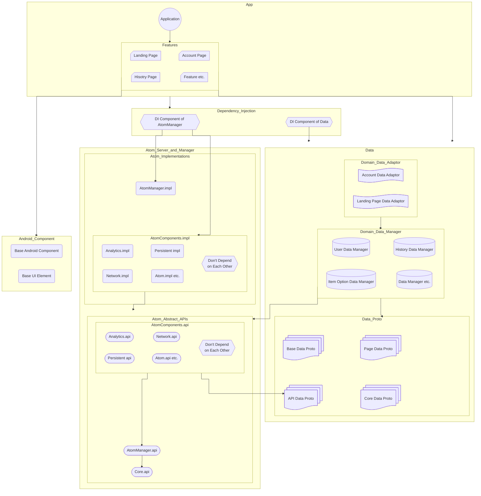

```mermaid
%%{ init: { 'flowchart': { 'curve': 'stepBefore' } } }%%
graph TB;

    subgraph App
        application@{ shape: circle, label: "Application" }
        application --> Features

        subgraph Features
            landing_page_feature@{ shape: notch-rect, label: "Landing Page" }
            account_page_feature@{ shape: notch-rect, label: "Account Page" }
            hisotry_page_feature@{ shape: notch-rect, label: "Hisotry Page" }
            feature_etc@{ shape: notch-rect, label: "Feature etc." }

            landing_page_feature ~~~ account_page_feature
            hisotry_page_feature ~~~ feature_etc
        end
    end
    App --> Dependency_Injection
    Features --> Data
    Features ----> Android_Component

    subgraph Data
        subgraph Domain_Data_Adaptor
            account_page_data_adaptor@{ shape: paper-tape, label: "Account Data Adaptor" }
            landing_page_data_adaptor@{ shape: paper-tape, label: "Landing Page Data Adaptor" }
        end

        subgraph Domain_Data_Manager
            user_data_manager@{ shape: cyl, label: "User Data Manager" }
            item_option_data_manager@{ shape: cyl, label: "Item Option Data Manager" }
            history_data_manager@{ shape: cyl, label: "History Data Manager" }
            data_manager_etc@{ shape: cyl, label: "Data Manager etc." }

            user_data_manager ~~~ history_data_manager
            item_option_data_manager ~~~ data_manager_etc
        end

        subgraph Data_Proto
            direction TB

            page_data_proto@{ shape: docs, label: "Page Data Proto" }
            base_data_proto@{ shape: docs, label: "Base Data Proto" }
            api_data_proto@{ shape: docs, label: "API Data Proto" }
            core_data_proto@{ shape: docs, label: "Core Data Proto" }

            page_data_proto ~~~ core_data_proto
            base_data_proto ~~~ api_data_proto
        end
    end
    Domain_Data_Adaptor --> Domain_Data_Manager
    Domain_Data_Manager --> Data_Proto
     Domain_Data_Manager --> Atom_Abstract_APIs

    subgraph Dependency_Injection
        dependency_injection_atom{{"DI Component of AtomManager"}}
        dependency_injection_data{{"DI Component of Data"}}
    end
    dependency_injection_atom --> atom_manager_impl
    dependency_injection_atom --> AtomComponents.impl
    dependency_injection_data --> Data

    subgraph Atom_Server_and_Manager

        direction TB

        subgraph Atom_Implementations

            direction TB

            atom_manager_impl("AtomManager.impl")

            subgraph AtomComponents.impl
                direction LR

                analytics_impl(Analytics.impl)
                persistent_impl("Persistent impl")
                network_impl("Network.impl")
                atom_components_impl_etc("Atom.impl etc.")

                note2{{Don't Depend<br>on Each Other}}

                analytics_impl ~~~ persistent_impl ~~~ note2
                network_impl ~~~ atom_components_impl_etc ~~~ note2
            end
            atom_manager_impl ~~~ AtomComponents.impl
        end
        Atom_Implementations ~~~ Atom_Abstract_APIs
        AtomComponents.impl --> Atom_Abstract_APIs

        subgraph Atom_Abstract_APIs
            subgraph AtomComponents.api
                direction LR

                analytics_api([Analytics.api])
                persistent_api(["Persistent api"])
                network_api(["Network.api"])
                atom_components_api_etc(["Atom.api etc."])
                note1{{Don't Depend<br>on Each Other}}

                analytics_api ~~~ network_api ~~~ note1
                persistent_api ~~~ atom_components_api_etc ~~~ note1
            end

            core_api(["Core.api"])

            atom_manager_api(["AtomManager.api"])
        end
        AtomComponents.api ----> atom_manager_api
        AtomComponents.api --> api_data_proto
        atom_manager_api --> core_api;
    end

    subgraph Android_Component
        base_android_component("Base Android Component")
        base_ui_elements("Base UI Element")

    end
```